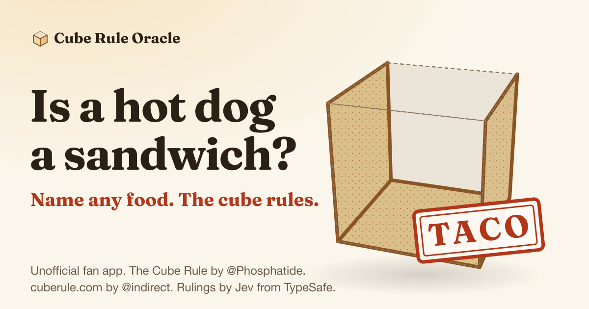
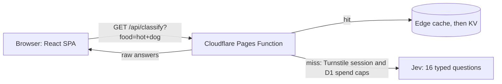

# Cube Rule Oracle

[](https://github.com/ctsstc/typesafe-ai-cube-rule/actions/workflows/ci.yml)

Name any food and get a ruling. The [Cube Rule](https://cuberule.com/) sorts food by where its structural starch sits, so every dish lands in one of nine cubes: toast, sandwich, taco, sushi, quiche, calzone, salad, cake or nachos. The Oracle asks Jev, a model from TypeSafe, where the starch is in whatever you type, then draws the cube and stamps the verdict. Is a hot dog a sandwich? The cube says taco.

**Try it at https://cube-rule-oracle.pages.dev**

[](https://cube-rule-oracle.pages.dev)

> [!NOTE]
> This is an unofficial fan app. It is not affiliated with or endorsed by cuberule.com, its creators or TypeSafe.

## Credits

- **The Cube Rule** was created by [@Phosphatide](https://twitter.com/Phosphatide), and [cuberule.com](https://cuberule.com/) is made by [@indirect](https://twitter.com/indirect). Go read the original. Canon rulings quote the site, including its ruling that humans are ravioli, which it credits to food critic Soleil Ho.
- **Rulings** by Jev from TypeSafe (https://typesafe.ai/).
- **Cube drawings** are this app's own CSS. No images from cuberule.com are used.
- **Made by** Cody Swartz ([GitHub](https://github.com/ctsstc), [LinkedIn](https://linkedin.com/in/codyswartz/)). Built with [Claude Code](https://claude.com/claude-code).

## How it works



- **One request, 16 typed questions.** Jev is a System One model: it returns probabilities, never text. Each new food is one request carrying 4 Choice questions (is it food, which cube, which cube if it were food, what kind of starch), 11 yes or no Nouls (is it abusive, is it wet, eight readings of where the starch sits, does it depend how it's served) and 1 Score (how hard people argue about it).
- **Raw answers, mapped in code.** The Function returns Jev's raw answers and the browser turns them into a ruling with `toCubeResult` from `packages/core`. Every sentence on the card is a template written ahead of time and filled in from those numbers, so copy and threshold changes never need new inference.
- **Canon wins.** Foods cuberule.com has already ruled on show the official ruling, and Jev's opinion appears as a dissent when it disagrees. Things that are not food get an honorary ruling, gibberish is uncubeable, and abusive text is declined without being echoed back.
- **Cached, so repeats are usually free.** A ruling is keyed by food and question set version and kept in the browser, Cloudflare's edge cache and KV. A food someone already asked about usually never reaches Jev.
- **A human check and spend caps guard the bill.** A new food needs a session cookie from a Cloudflare Turnstile check, which usually runs unseen. Before each Jev call, D1 counts it against the session (60), the client IP for the UTC day (150, stored only as a keyed hash) and the whole day (1,000 by default). The Function fails closed.

[docs/question-design.md](docs/question-design.md) explains the questions and thresholds, and [docs/ux-spec.md](docs/ux-spec.md) covers the interface.

## Quick start

Needs an even-numbered Node release from 22.13 on (CI runs 24; the tests use `node:sqlite`, which 22.13 unflagged) and pnpm 10. `corepack enable` picks up the pinned pnpm version. Node 25 and later no longer ship Corepack, so run `npm i -g corepack` first, or install pnpm 10 directly.

```sh
pnpm i
cp .env.example .env
pnpm dev
```

Open http://localhost:5173. `pnpm dev` runs Vite on 5173 and the Pages Function under `wrangler pages dev` on 8788, and Vite proxies `/api` to the Function.

**No key needed to start.** With `TYPESAFE_API_KEY` empty, the Function serves mock rulings: deterministic for each food and shaped exactly like live answers, but not real. The app shows a demo banner and stamps every card "Simulated". For UI work without wrangler, `pnpm --filter @cube/web dev:mock` adds trigger foods for every state, such as `mock torn`, `mock 429` and `mock timeout` (see [docs/ux-spec.md](docs/ux-spec.md#14-mock-mode)).

**Live rulings need a TypeSafe account.** Create a key at https://console.typesafe.ai/keys and put it in `.env` as `TYPESAFE_API_KEY`. Each new food is one Jev call of about 9,600 input tokens, roughly $0.0004 at [TypeSafe's published price](https://docs.typesafe.ai/models.md).

> [!IMPORTANT]
> The key belongs only in the root `.env` (gitignored) locally and in a Pages secret in production. It must never reach the browser bundle, a commit or a log line. `apps/web/src/bundle.test.ts` fails `pnpm check` if the bundle contains the TypeSafe API host, the SDK or any question text.

## Commands

| Command | Does |
| --- | --- |
| `pnpm dev` | Vite on 5173 and the Function on 8788 |
| `pnpm dev:challenge [pass\|fail\|interactive\|spent] [--preview]` | Like `pnpm dev`, with the Turnstile check on, using Cloudflare's test keys |
| `pnpm preview:pages` | Builds the SPA and serves it with the Function and production headers on 8788 |
| `pnpm build` | Builds `apps/web/dist` |
| `pnpm check` | Typecheck, Biome lint and every Vitest project. CI runs this, with no key and no network |
| `pnpm format` | Biome format and safe fixes |
| `pnpm eval` | Runs the labelled food set against Jev (see below) |
| `pnpm deploy:pages` | Guarded production deploy. Bare `pnpm deploy` is pnpm's own command and does not run it |
| `pnpm spend [--detail]` | Read-only Jev spend report from the production D1 counters (see [docs/deploy.md](docs/deploy.md#watching-spend)) |

## Evaluation

`eval/` holds 204 labelled items and a harness that asks Jev every question for each one, then scores Jev's own ruling. On question set 6 with `jev-1.13.0`:

| Split | Right |
| --- | --- |
| Holdout, looked at only after each version was final | 60/62, or 52/54 without items the ruling questions use as worked examples |
| Tune, which the questions were rewritten against | 95/97 |
| Canon rulings from cuberule.com | 45/45 |
| Abusive probes declined | 21/21, with 0 false declines among the other 183 items |

Labels outside canon are this project's reading of the site's rules. Answers are cached per question set, so `pnpm eval --offline` rescores for free, and a full live pass costs about $0.08. [docs/eval.md](docs/eval.md) explains the splits and records every tuning round.

The site's [How Jev rules](https://cube-rule-oracle.pages.dev/#how-jev-rules) section shows these numbers, read from `eval/results/v<QUESTION_SET_VERSION>/summary.json` at build time. Bumping `QUESTION_SET_VERSION` therefore fails `pnpm build` and `pnpm check` until a complete run for the new version is committed.

The 21 abusive probes are stored base64-encoded so they never show up as plain text in the code, but decoding them shows offensive text. Real dishes with rude-sounding names appear in plain text on purpose, as tests that the guard does not decline them.

## Deploying your own

The app is one Cloudflare Pages project: the static SPA plus a Pages Function for `/api`, with a KV namespace, a D1 database and a Turnstile widget. [docs/deploy.md](docs/deploy.md) walks through the one-time setup, the deploy script's safety checks, rollback, caching and spend limits.

A fork has to replace a few values that point at this project's Cloudflare account:

- `scripts/deploy.sh` and `scripts/spend.mjs` only act on the Cloudflare account set as `CLOUDFLARE_ACCOUNT_ID` in your root `.env` (see `.env.example`), and refuse to run without it.
- `apps/web/src/lib/links.ts` holds the author and source repo links, and `scripts/deploy.sh` refuses to deploy until `SOURCE_URL` answers 200.
- `apps/web/wrangler.jsonc` keeps placeholder KV and D1 ids. Put your own in `.env` as `CLOUDFLARE_KV_CLASSIFICATIONS_ID` and `CLOUDFLARE_D1_DATABASE_ID`; the deploy scripts write them into a gitignored `wrangler.production.jsonc`.
- `SITE_URL`, which fills the canonical and Open Graph URLs, defaults to https://cube-rule-oracle.pages.dev in `scripts/deploy.sh` and `apps/web/vite.config.ts`.

## For Claude Code users

[CLAUDE.md](CLAUDE.md) and `.claude/` are instructions and settings for coding agents, not docs for people. `.claude/settings.json` offers TypeSafe's [skills plugin](https://github.com/typesafe-ai/skills) at project scope once you trust the folder, and `.claude/launch.json` defines the local preview servers.

## Project layout

```text
apps/web/                 Vite + React SPA and the Pages project
  src/                    App shell, ruling card, CSS 3D cube, gallery, How Jev rules, about
  functions/api/          Pages Functions: classify.ts, session.ts and a JSON 404 for other /api paths
  functions/_lib/         Handlers, session cookie, D1 spend caps, HTTP helpers, rate limiter, tests
  migrations/             D1 schema for the spend caps
  public/                 _headers (CSP), _routes.json, icons, og.png
  og/                     SVG sources for the link preview card and icons
  plugins/                Vite plugins: font preload, site URL, eval stats, keyless mock API
  wrangler.jsonc          Pages config
packages/core/            @cube/core: categories, Jev questions and thresholds, input
                          normalization, official rulings, result logic, mock, wire types
eval/                     Labelled dataset, eval harness and results per question set
docs/                     Question design, eval, UX spec, canon audit and deploy runbook
scripts/                  pages-dev.sh (local wrangler), dev-challenge.sh, deploy.sh and spend.mjs
```

## License

[MIT](LICENSE) covers this project's code, CSS cube drawings, eval harness and eval labels. The Cube Rule itself, cuberule.com's rulings and captions, and the names TypeSafe and Jev belong to their owners and are not part of that grant.

Release notes are in [CHANGELOG.md](CHANGELOG.md).
